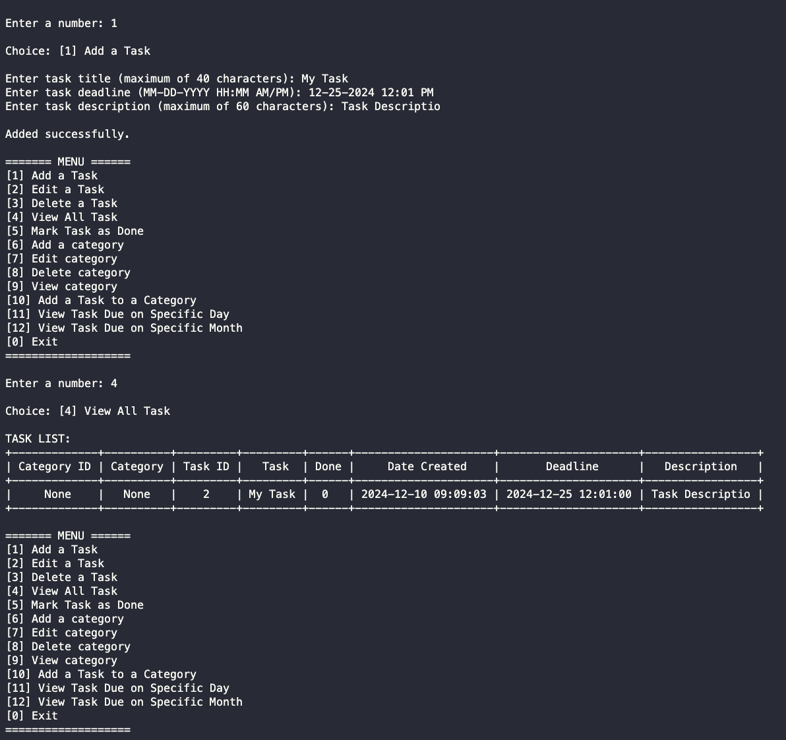

# SQL PROJECT: TASK MANGEMENT SYSTEMS

## Instructions
1. Open a terminal and install pip using python. Command: -m pip install --upgrade pip
2. Install mysql connector using pip. Command: pip install mysql-connector-python
3. Refer to this link for reference: https://www.youtube.com/watch?v=oDR7k66x-AU
4. Open 'function.py'. In line 13, configure the user and password section to your desired user and its password.
5. Run the program. Command: py main.py

## See for yourself!
Clone the repository: `https://github.com/kurtbrii/sql-task-system.git`

Type `poetry install` to install dependencies

To run file: `poetry run python main.py`

## Screenshot
